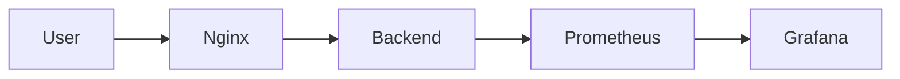
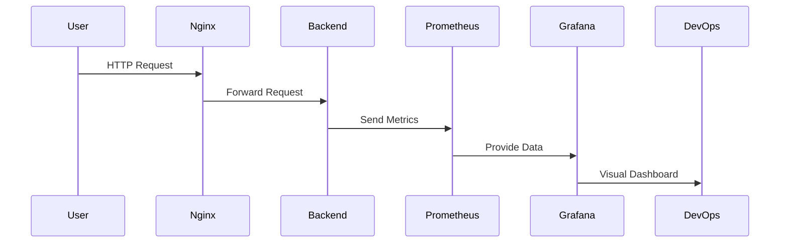

<div align="center">


<br/>


<br/>
<br/>

### 🐳 Production-Style Containerized Monitoring Architecture  
### Built for Real DevOps Environments

</div>

---

# 🌟 Project Overview

This project demonstrates how DevOps engineers deploy, monitor, and visualize containerized applications using Docker.

We simulate a **real production environment** where:

- Application runs inside containers  
- Nginx acts as reverse proxy  
- Prometheus collects metrics  
- Grafana visualizes dashboards  

This is a **complete monitoring stack** used in real companies.

---

# 🧠 What You Will Learn

✔ Docker containerization  
✔ Multi-container architecture  
✔ Monitoring & observability  
✔ Prometheus metrics scraping  
✔ Grafana dashboards  
✔ DevOps workflow  
✔ Reverse proxy setup  
✔ Production-style deployment  

---

# 🏗️ Architecture Diagram



---

# 🔄 Request Flow



---

# 📸 Monitoring Stack Preview

<div align="center">

Prometheus → Metrics Collection  
Grafana → Visualization  
Docker → Containers  
Nginx → Routing  

</div>

---

# 📁 Project Structure

```
docker-devops-project/
│
├── docker-compose.yml
│
├── backend/
│   ├── app.js
│   ├── package.json
│   └── Dockerfile
│
├── nginx/
│   └── nginx.conf
│
├── prometheus/
│   └── prometheus.yml
│
└── README.md
```

---

# 🚀 Step-by-Step Creation

## 1️⃣ Create Project Folder

```bash
mkdir docker-devops-project
cd docker-devops-project
```

## 2️⃣ Create Folders

```bash
mkdir backend nginx prometheus
touch docker-compose.yml
```

---

## 3️⃣ Backend Setup

```bash
cd backend
nano app.js
nano package.json
nano Dockerfile
```

---

## 4️⃣ Nginx Setup

```bash
cd ../nginx
nano nginx.conf
```

---

## 5️⃣ Prometheus Setup

```bash
cd ../prometheus
nano prometheus.yml
```

---

## 6️⃣ Docker Compose

```bash
cd ..
nano docker-compose.yml
```

---

# ▶️ Run Project

```bash
docker compose up -d --build
```

Check containers:

```bash
docker ps
```

---

# 🌐 Access Services

| Service | URL |
|--------|-----|
| App | http://SERVER-IP |
| Prometheus | http://SERVER-IP:9090 |
| Grafana | http://SERVER-IP:3000 |

Grafana login:
```
admin / admin
```

---

# 📊 Grafana Query

```
rate(http_requests_total[1m])
```

---

# 🧪 Generate Traffic

```bash
for i in {1..200}; do curl http://localhost/api; done
```

---

# 🛠 DevOps Skills Demonstrated

- Docker  
- Monitoring  
- Observability  
- Reverse Proxy  
- Metrics Collection  
- Dashboarding  
- Production Architecture  

---

# 💼 Resume-Ready Project Description

**Docker Monitoring Stack using Prometheus & Grafana**

Built a production-style containerized monitoring architecture using Docker Compose, Nginx reverse proxy, Prometheus metrics scraping, and Grafana dashboards to visualize application performance.

---

# ⭐ Why This Project Matters

Real companies use this stack.

This project proves you understand:

- Monitoring  
- Containers  
- DevOps pipelines  
- Observability  

Perfect for:

- DevOps interviews  
- Resume  
- GitHub portfolio  

---

# 👨‍💻 Author

**Arkan Tandel**  
DevOps Engineer 🚀  

GitHub: https://github.com/arkantandel  
LinkedIn: https://www.linkedin.com/in/arkan-tandel  

---

<div align="center">


⭐ Star this repo if it helped you

</div>
